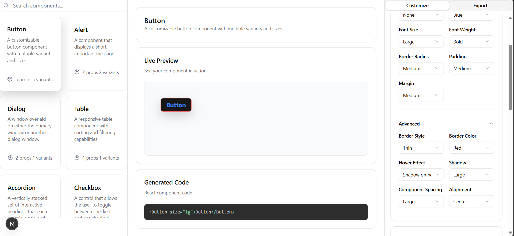

# ⚙️ React Component Generator

> Interactive Shadcn UI component customizer with real-time preview and copy-ready code generation.

Repository: https://github.com/Mahdirnj/React-Component-Generator


Transform your UI development workflow with live component customization, intelligent theming, and instant code export. Built with Next.js 15, React 19, and modern web technologies.



## ✨ Features

### 🔥 Live Component Preview
- Real-time property controls with instant visual feedback
- Copy-ready code generation with syntax highlighting
- Responsive preview across screen sizes


### 🌙 Intelligent Dark Mode
- System-aware theming with automatic detection
- Manual override controls (Light/Dark/System)
- Smooth transitions with reduced-motion support
- Hydration-safe implementation to avoid SSR/CSR mismatches

### 🎛️ Advanced Style Controls
- Preset style combinations for rapid prototyping
- Granular property customization with live preview
- Reset functionality to prevent style bleeding
- Collapsible advanced options for clean UX

### 🍞 Toast Customization
- Live toast preview using Sonner
- Position, duration, and style controls
- Rich colors and theme-aware styling
- Per-instance attribute configuration


## 🚀 Technology Stack

### Core Framework
- Next.js 15.5.4 (App Router, Turbopack, Server Components)
- React 19.1.0
- TypeScript

### UI & Styling
- Tailwind CSS v4 with custom tokens
- Radix UI primitives
- shadcn/ui component library

### State & Theming
- Zustand 5.0.8 (state management)
- next-themes 0.4.6 (dark mode)
- Sonner 2.0.7 (toasts)

### Developer Experience
- react-syntax-highlighter (code preview)
- ESLint
- Turbopack hot reload

## 🛠️ Installation

Prerequisites: Node.js 18+, npm/yarn/pnpm

```bash
# Clone the repository
git clone https://github.com/Mahdirnj/React-Component-Generator.git
cd React-Component-Generator

# Install dependencies
npm install

# Start development server
npm run dev

# Optional: Custom port
npm run dev -- --port 3003
```

Visit http://localhost:3000 (or your custom port) to see the application.

## 📖 Usage Guide

### Basic Workflow
1. Select a component from the sidebar
2. Customize properties using the style controls
3. Preview changes in real-time
4. Copy generated code for your project

### Advanced Features
- Theme switching via header toggle
- Style presets for quick iteration
- Toast configuration and preview
- Responsive preview across screen sizes

## ⚙️ Configuration

Key files:
- next.config.ts — build/dev options (configured for static export)
- src/app/providers.tsx — ThemeProvider settings
- src/app/globals.css — global styles and transitions
- components.json — registry of UI components and props

Environment variable (optional for GitHub Pages Project Pages):
```env
NEXT_PUBLIC_BASE_PATH=/React-Component-Generator
```

## 🏗️ Architecture

Project structure:
```
src/
├── app/                 # Next.js App Router
│   ├── layout.tsx      # Root layout with providers
│   ├── page.tsx        # Main application page
│   └── providers.tsx   # Theme and state providers
├── components/
│   ├── features/       # Feature-specific components
│   ├── layouts/        # Layout components
│   └── ui/             # shadcn/ui components
├── hooks/              # Custom React hooks
├── lib/                # Utilities and helpers
├── stores/             # Zustand state stores
└── types/              # TypeScript type definitions
```

Key implementation details:
- Hydration-safe theming (suppressHydrationWarning and mounted gating)
- Centralized state management via Zustand
- Accessible UI using Radix primitives
- Performance-aware design with code splitting

## 🚀 Deployment

### GitHub Pages (Static Export)
The repository includes a workflow at `.github/workflows/nextjs.yml` to build and deploy.

```bash
# Build for static export
npm run build
```

If using Project Pages, ensure `NEXT_PUBLIC_BASE_PATH=/React-Component-Generator` and `basePath`/`assetPrefix` are configured in `next.config.ts`.

Live URL pattern: https://mahdirnj.github.io/React-Component-Generator/

### Vercel (Recommended)
1. Push your repository to GitHub
2. Import at https://vercel.com/new
3. Vercel automatically builds and deploys

### Other Platforms
- Netlify: deploy the `out/` folder
- AWS S3: upload static files after `npm run build`

## 🤝 Contributing

1. Fork the repository
2. Create a feature branch
3. Commit changes and open a pull request

Development guidelines:
- Follow code style and conventions
- Add tests for new features where applicable
- Update documentation when necessary
- Ensure accessibility and performance are considered

## 📄 License

MIT License — see [LICENSE.txt](LICENSE.txt).

## 🙏 Acknowledgments

- shadcn/ui for the component library
- Vercel for Next.js and hosting
- Radix UI for accessible primitives

---

**Star the repo:** https://github.com/Mahdirnj/React-Component-Generator

**Report issues / request features:** https://github.com/Mahdirnj/React-Component-Generator/issues
